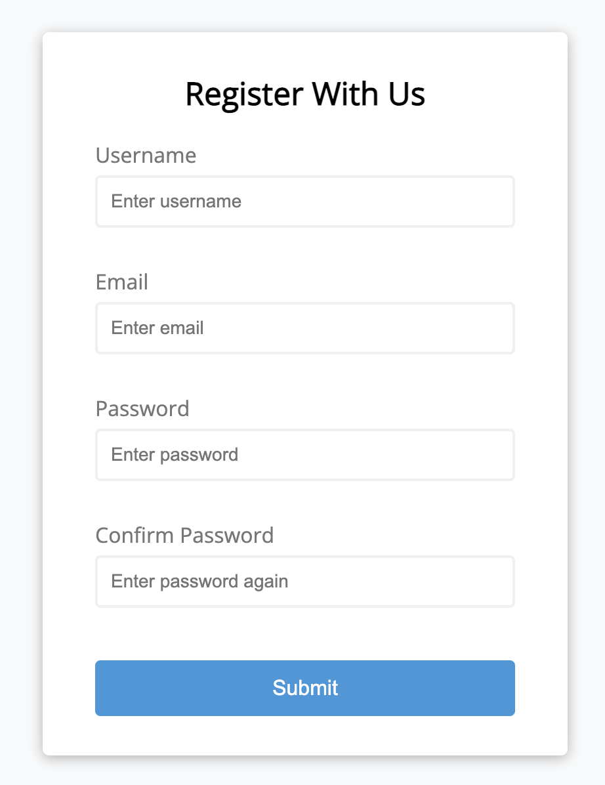

# Form Validator

A simple JavaScript-based form validation project that ensures user inputs meet specific criteria. This project validates fields such as username, email, password, and password confirmation, providing real-time feedback for errors and success.

## Features

- **Required Field Validation**: Ensures all fields are filled out.
- **Email Validation**: Checks if the email format is valid.
- **Input Length Validation**: Enforces minimum and maximum character limits for username and password.
- **Password Match Validation**: Confirms that the password and confirmation fields match.
- **Real-Time Feedback**: Highlights errors and successes with visual cues.

## Technologies Used

- HTML
- CSS
- JavaScript

## How to Use

- Clone the repository.
- Open `index.html` in your browser.
- Fill out the form and observe the validation feedback.
